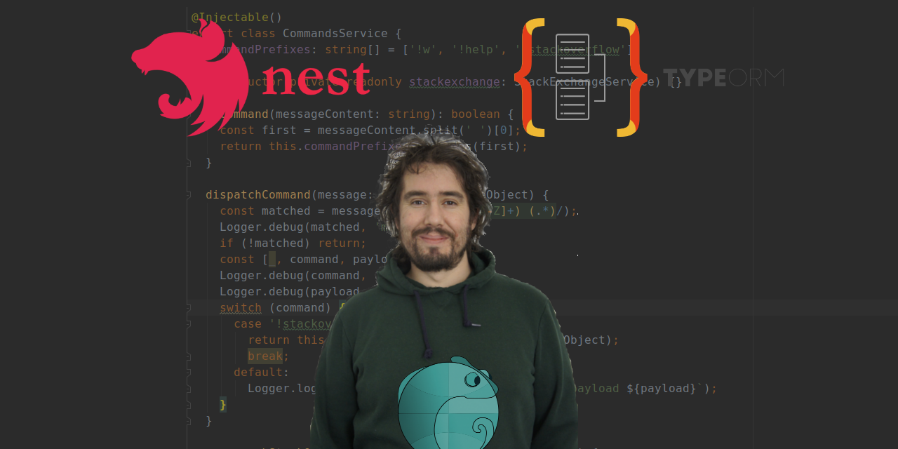

# [Unit testing NestJS with Typeorm in memory](https://dev.to/webeleon/unit-testing-nestjs-with-typeorm-in-memory-l6m)

Assuming you already configured TypeORM in your NestJS project.
If you need to setup TypeORM, consider reading the [awesome NestJS documentation](https://docs.nestjs.com/techniques/database).

For the sake of testing something, I'll setup a simple API that will serve spaceships! You can access the [sample repository on github](https://github.com/Webeleon/unit-testing-nestjs-using-typeorm-in-memory).

## Install SQLITE

```bash
npm i -D better-sqlite3
```

## A few helpers

Ok, we can write this for every test files BUT we are lazy developers and will not spend our time re-writing the same code over and over and over...

Let's write a simple helper function that will provide an easy to import pre-configured TypeORM module!
`src/test-utils/TypeORMSQLITETestingModule.ts`

```ts
import { TypeOrmModule } from '@nestjs/typeorm';
import { Spaceship } from '../spaceships/spaceship.entity';

export const TypeOrmSQLITETestingModule = () => [
  TypeOrmModule.forRoot({
    type: 'better-sqlite3',
    database: ':memory:',
    dropSchema: true,
    entities: [Spaceship],
    synchronize: true,
  }),
  TypeOrmModule.forFeature([Spaceship]),
];
```

This one is not mandatory but a simple test dataset is always a nice to have. `src/test-utils/testDataset.seed.ts`

```ts
import { getConnection } from 'typeorm';
import { Spaceship } from '../spaceships/spaceship.entity';

export const testDatasetSeed = async () => {
  const connection = await getConnection();
  const entityManager = connection.createEntityManager();

  entityManager.insert<Spaceship>(Spaceship, {
    name: 'moa',
    type: 'cruiser',
    origin: 'caldari',
  });
  entityManager.insert<Spaceship>(Spaceship, {
    name: 'caracal',
    type: 'cruiser',
    origin: 'caldari',
  });
  entityManager.insert<Spaceship>(Spaceship, {
    name: 'rokh',
    type: 'battleship',
    origin: 'caldari',
  });
};
```

## Using the helpers in a test file

In order to allow tests to use the im memory database, you'll just need to call the function `...TypeOrmSQLITETestingModule()` and spread it since it provide the `TypeOrmModule.forRoot` and `TypeOrmModule.forFeature`.

Finally, seed the test data (or not) `await testDatasetSeed();`.

```ts
import { Test, TestingModule } from '@nestjs/testing';
import { SpaceshipsService } from './spaceships.service';
import { TypeOrmSQLITETestingModule } from '../test-utils/TypeOrmSQLITETestingModule';
import { testDatasetSeed } from '../test-utils/testDataset.seed';

describe('SpaceshipsService', () => {
  let service: SpaceshipsService;

  beforeEach(async () => {
    const module: TestingModule = await Test.createTestingModule({
      imports: [...TypeOrmSQLITETestingModule()],
      providers: [SpaceshipsService],
    }).compile();

    service = module.get<SpaceshipsService>(SpaceshipsService);
    await testDatasetSeed();
  });

  it('listSpaceships', async () => {
    const spaceships = await service.listSpaceships();
    expect(spaceships).toHaveLength(3);
  });
});
```

## Questions?


I'll be glad to answers questions in the comments.

If you liked my discord consider joining my coding lair!
:phone:[Webeleon coding lair on discord](https://discord.gg/h7HzYzD82p)

You can also email me and offer me a contract :moneybag:
:envelope:[Email me!](julien@webeleon.dev)

And since I'm a nice guy, here, take this sample repo containing a working codebase!
:gift:[Get the code of the tuto from github](https://github.com/Webeleon/unit-testing-nestjs-using-typeorm-in-memory)

<script type="text/javascript" src="https://cdnjs.buymeacoffee.com/1.0.0/button.prod.min.js" data-name="bmc-button" data-slug="webeleon" data-color="#FFDD00" data-emoji="" data-font="Cookie" data-text="Buy me a coffee" data-outline-color="#000000" data-font-color="#000000" data-coffee-color="#ffffff" ></script>
